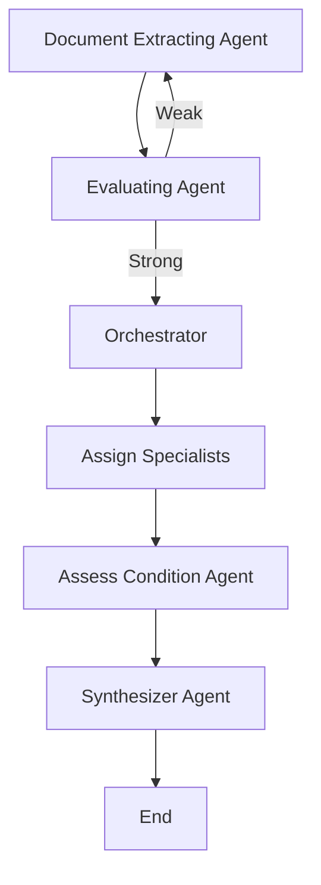

# Multi-agent System for Historic Vessel Maintenance

LLM-based multi-agent system designed to automate the analysis of inspection reports and determine maintenance recommendations for the historic vessel, SS Great Britain.

## Project Overview

This project simulates a real-world scenario where a multi-agent system processes inspection reports from marine heritage consultancies to provide automated maintenance recommendations for the SS Great Britain - an iron steamship launched in 1843 and now preserved as a museum ship in Bristol's Great Western Dockyard.

### Key Features

- **Automated Document Processing**: Extracts key insights from unstructured inspection reports
- **Multi-perspective Analysis**: Evaluates vessel condition across three critical engineering domains
- **Intelligent Workflow**: Uses feedback loops and quality control mechanisms
- **Scalable Architecture**: Designed to handle multiple inspection sources and vessel types

## System Architecture

The system employs a six-stage workflow with specialized agents:

1. **Document Extracting Agent**: Extracts key insights from inspection reports
2. **Evaluating Agent**: Quality control with feedback loops for insight validation
3. **Orchestrator**: Organizes insights by ship section and engineering perspective
4. **Decision Point**: Routes workflow based on quality assessment
5. **Assess Condition Agent**: Specialized analysis for each engineering perspective
6. **Synthesizer Agent**: Combines insights to provide maintenance timeframe recommendations

## Engineering Perspectives

The system analyzes vessel condition across three specialized domains:

### Structural Integrity
- Hull plate corrosion and thickness measurements
- Rivet condition and structural joint integrity
- Frame deformation and stress analysis
- Watertight bulkhead condition

### Corrosion Management
- Surface rust classification and progression
- Protective coating effectiveness
- Galvanic corrosion at dissimilar metal joints
- Environmental exposure assessment

### Conservation Engineering
- Original material preservation vs. replacement decisions
- Historical authenticity of repair methods and materials
- Visitor safety integration with heritage preservation
- Climate control effectiveness in preservation areas

## Technology Stack

- **LangChain**: Core framework for LLM integration and workflow management
- **LangGraph**: Workflow orchestration and state management
- **Google Gemini 2.0 Flash**: Primary LLM for natural language processing
- **Python**: Core programming language
- **Pydantic**: Data validation and serialization

## Requirements

```bash
pip install langchain
pip install langgraph
pip install langchain-google-genai
pip install pydantic
pip install typing-extensions
```

## Getting Started

### 1. API Key Setup

Obtain a Google Gemini API key from [Google AI Studio](https://aistudio.google.com/) and set it in your environment:

```python
API_KEY = "YOUR_GOOGLE_API_KEY_HERE"
os.environ['GOOGLE_API_KEY'] = API_KEY
```

### 2. Data Preparation

Place your inspection reports (`.md` format) in the `./data/` directory:

```
project/
├── data/
│   ├── inspection_report_1.md
│   ├── inspection_report_2.md
│   └── ...
├── main.py
└── README.md
```

### 3. Usage examples

```python
# Initialise the workflow
compiled_wf = mas_workflow.compile()

# Define maintenance assessment task
task_prompt = "Determine maintenance timeframe for SS Great Britain based on current inspection reports"

# Execute the multi-agent workflow
response = compiled_wf.invoke({
    "docs": docs,
    "task": task_prompt
})

# View results
for condition in response["condition"]:
    print(f"Perspective: {condition.perspective}")
    print(f"Summary: {condition.summary_condition}")
    print(f"Rating: {condition.rating_condition}")
```

## Ship Sections Analyzed

### Hull Sections
- **Forward Hull**: Bow area including figurehead and forward plating
- **Midship Hull**: Central section with engine room and main structural elements
- **Aft Hull**: Stern section including propeller housing and rudder assembly

### Superstructure Sections
- **Upper Deck**: Main deck level including masts and rigging points
- **Lower Deck**: Passenger and cargo areas below main deck
- **Engine Room**: Historic steam engine and related machinery spaces

## Workflow Design



## Sample Output

```
Perspective: corrosion management
Summary: Address galvanic corrosion at the propeller shaft bearing, 
         Spot-repair coating holidays on the midship hull1

Perspective: structural integrity  
Summary: The ship requires some structural work, continue monitoring 
         hull plating and stern frame

Perspective: conservation engineering
Summary: Schedule deep cleaning of less accessible engine room areas
```

## Key Achievements

- Automated extraction and categorization of technical findings from unstructured reports
- Successful integration of multiple engineering perspectives into coherent recommendations
- Effective handling of domain-specific terminology and measurement standards
- Demonstration of scalable architecture for processing multiple inspection sources

## Current Limitations

- **Mock Data Dependency**: Current evaluation relies on LLM-generated mock data
- **Formatting Variations**: Real inspection reports may have inconsistent formatting
- **Missing Data Handling**: Limited error handling for incomplete input data

## Future Improvements

### Possible Enhancements
- Implementation of confidence scoring for extracted insights
- Development of robust error handling for incomplete/inconsistent input data
- Validation with authentic inspection reports from maritime heritage organizations
- Extended testing across different vessel types and inspection methodologies

## License

This project is open source and available under the [MIT License](LICENSE).

## Acknowledgments

- **Inspiration**: Original problem design by Dr. Marco Perez Hernandez
- **Data Generation**: Mock inspection reports generated using Claude Sonnet 4.0 by Anthropic
- **SS Great Britain Photograph**: mattbuck, CC BY-SA 3.0, https://commons.wikimedia.org/w/index.php?curid=7335238

---

**Note**: All inspector names and resemblance to actual persons in the mock data is purely coincidental and not intentional.